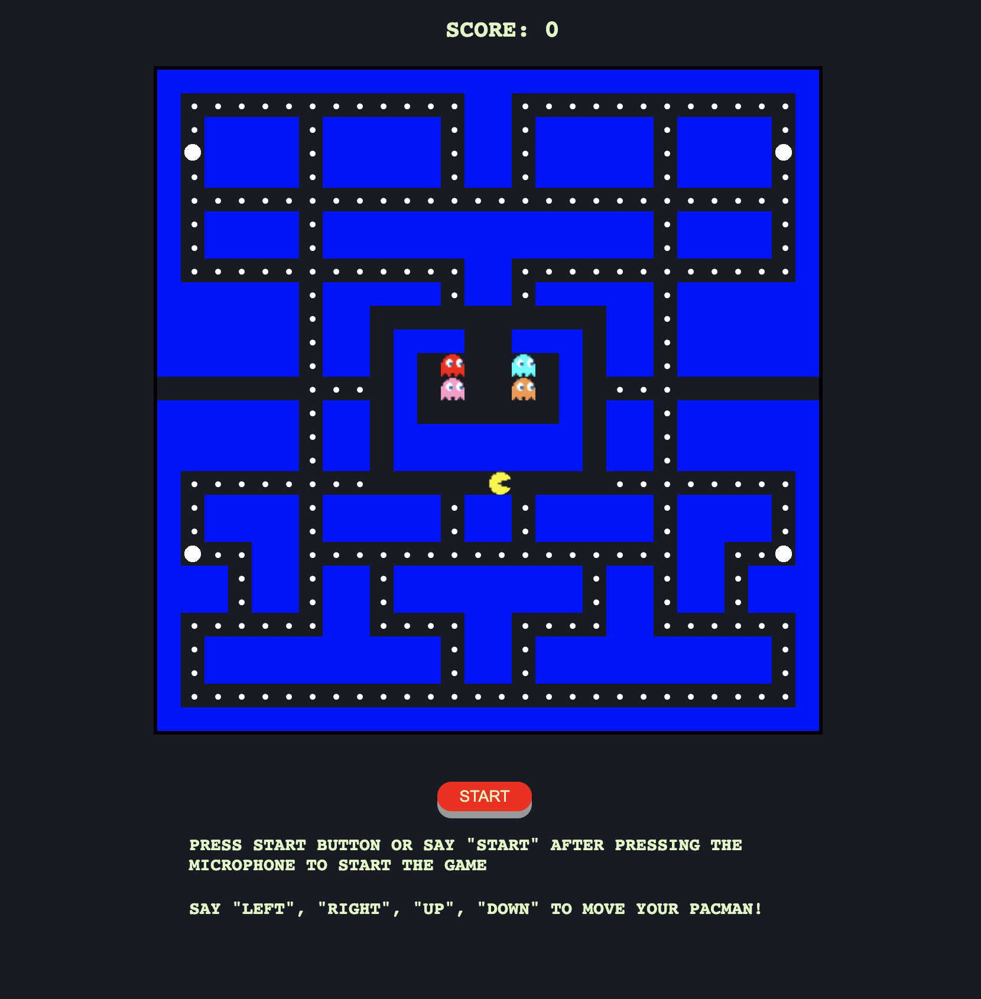

# Pacman-With-Voice-Commands

## Requirement

- Get your own [Alan AI SDK key] (https://alan.app/) for voice commands

## How to open the file and play
Download code as a zip file.
Paste your **Alan AI SDK Key** on line **420** under **app.js** file.

- There are two ways:
1. Double click **index.html** and click *Copy Path*. Then paste the paste in your favorite browser.
2. Double click **index.html** and click *Open In Default Browser*. 

## Resources
[Alan AI] (https://alan.app/)
[JavaScript on W3School] (https://www.w3schools.com/js/)
[CSS on W3School] (https://www.w3schools.com/css/)
[HTML on W3School] (https://www.w3schools.com/html/)
[HTML5 Pacman CodePen] (https://codepen.io/hellokatili/pen/xwKRmo)
[Mozilla CSS related docs] (https://developer.mozilla.org/en-US/)
[Build PACMAN in vanilla JavaScript, HTML and CSS] (https://www.youtube.com/watch?v=CeUGlSl2i4Q&list=RDCMUC5DNytAJ6_FISueUfzZCVsw&index=8)
[Build Pacman in pure JavaScript with voice commands] (https://www.youtube.com/watch?v=kBVaH3D92H8)

## MIT Licence
Copyright (c) 2021 Aiko Zhao

